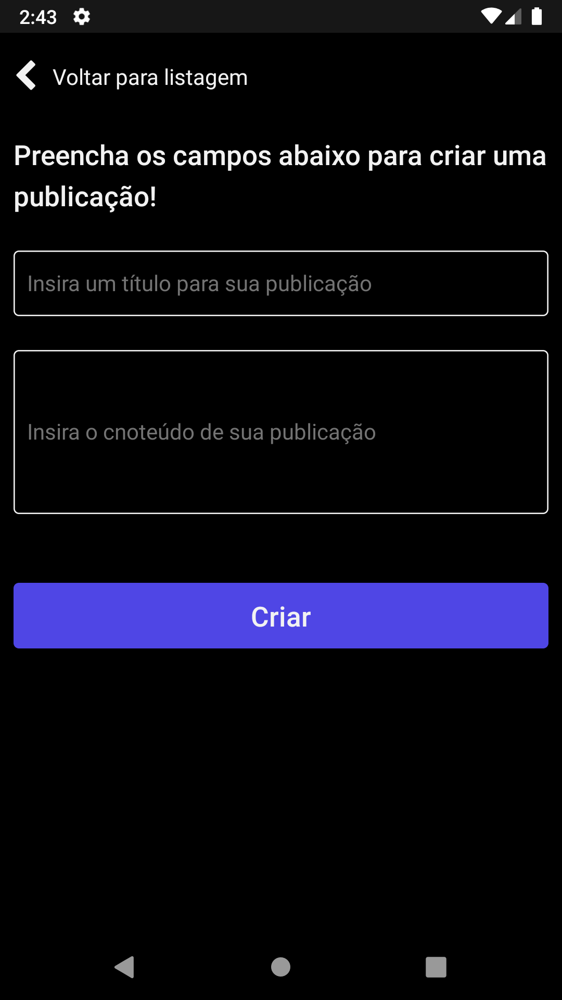

# Desafio Front-end - Plantão Ativo

###### Antes de passar para os próximos tópicos, leia mais sobre:

> Clean Architecture é uma arquitetura de software proposta por Robert Cecil Martin (ou Tio Bob, como é mais conhecido) que visa padronizar e organizar o código desenvolvido, favorecendo sua reutilizabilidade, bem como a independência tecnológica. (fonte: https://www.zup.com.br/blog/clean-architecture-arquitetura-limpa)

> Model–view–presenter (MVP) é uma derivação do padrão de software model-view-controller (MVC), usado também para construir principalmente interfaces gráficas. Em MVP a camada Presenter assume a função de mediadora (executada pelo Controller em MVC). Além disso, a View é responsável por manipular os eventos UI (como mouseDown, keyDown, etc.), que era o trabalho da Controller. Finalmente, a Model se torna estritamente um modelo de domínio. (fonte: https://medium.datadriveninvestor.com/model-view-presenter-mvp-5c3439227f83)

> Na programação de computadores orientada a objetos, o termo SOLID é um acrônimo para cinco postulados de design, destinados a facilitar a compreensão, o desenvolvimento e a manutenção de software. (fonte: https://pt.wikipedia.org/wiki/SOLID)

---

## Sobre a implementação

Para o desenvolvimento, foi utilizado o _React Native_ com _TypeScript_. A implementação está focada principalmente no Android. Mas, você não deve ter problemas ao executá-la no IOS. Como já mencionado, o principal objetivo desta aplicação é servir como base comprabatória de meus conhecimentos técnicos para a empresa Plantão Ativo. A Aplicação consiste num aplicativo capaz de ler, criar, deletar e favoritar publicações fornecidas através de uma Fake API. Opter por fazer esta implementação utilizando o padrão arquitetural MVP, afim de promover uma aplicação escalável desde o dia 0, escrita para o futuro e, claro, com foco em alta coesão e baixo acoplamento (apesar de que em alguns casos isso não foi 100% atingido).

## Sobre a arquitetura

Como mencionado no tópico anterior, foi utilizado o padrão arquietural MVP (Model-View-Presenter) como forma de promover o uso de uma arquietura limpa.

Resumidamente, seguimos implementando nossas regras de negócio, através de interfaces (Interface Segregation Principle) na camada de domínio (Domain), fazemos a implementação concreta (Dependecy Inversion Principle) dos casos de uso na camada de dados (Data). A cama de infraestrutura (Infra) é responsável por se comunicar com serviços externos a nossa aplicação, é ela que vai estabelecer os protocolos necessários para que essa comunicação ocorra. A camada de apresentação (Presentation) é responsável, no caso do front-end, por servir, além do nosso presenter, também nossa UI.

No MVP, para mantermos as camadas, digamos... Mais voltadas para a lógica, totalmente desacopladas e independentes, precisamos sacrificar alguma parte de nossa aplicação para isso. Portanto, temos criamos a camada Main que fará exatamente isso. É nela que vamos compôr de fato os casos de usos, usando, por exemplo, o Composite Pattern.

Você pode obter mais detalhes da arquitetura desta aplicação [clicando aqui](https://whimsical.com/pafrontendchallengearchitecture-9GEceWiVpeyQspVer8SzgW)

## Sobre o projeto

O Aplicativo contém as seguintes tecnologias:

- React Native
- TypeScript
- React Navigation
- Async Storage (poderia ser qualque db offline, como RealmDB, WatermelonDB)
- Axios
- Styled Components
- Lottie Files para animações





## Como rodar o projeto

Instale as depedências do projeto.

```bash
yarn
```

ou, se preferir

```bash
npm install
```

Então, dependendo da plataforma em que você deseja executar o projeto, basta executar:

```bash
yarn android
```

```bash
yarn ios
```

ou, se preferir

```bash
npm run android
```

```bash
npm run ios
```
